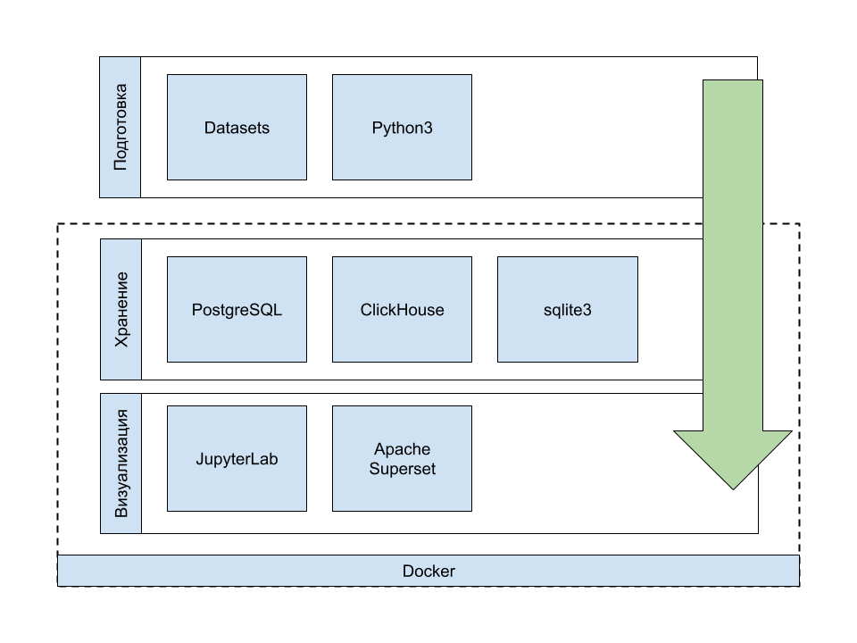

# Что это такое и зачем это нужно
## Описание

Данный репозиторий представляет собой основу, которая включает в себя базовый набор необходимых инструментов для анализа данных.

Репозиторий разделен на три логические группы и включает в себя следующие инструменты.

1. **Этап подготовки данных**
    - Python3
2. **Хранение данных**
    - PostgreSQL
    - ClickHouse
    - Sqlite3
3. **Визуализация данных**
    - JupyterLab
    - Apache Superset

Этапы `2` и `3` выполняются в рамках `docker`. 

# Как запустить
`docker compose  up --build`

# Доспуп к сервисам
| Сервис | Url | Описание | 
|---------|-----------|---------------|
| JupyterLab | [http://localhost:8888/](http://localhost:8888/) |  |
| Apache Superset | [http://localhost:8088/](http://localhost:8088/) |  |
| PostgreSQL | [http://localhost:5432/](http://localhost:5432/) |  |
| ClickHouse | [http://localhost:8123/](http://localhost:8123/) |  |

# Демо данные

| Url | Описание | 
|---------|-----------|
| [Chinook](./md/SQL_THEORY.md) | Chinook [^1] |
| [Kaggle / Superstore Sales Dataset](https://www.kaggle.com/datasets/rohitsahoo/sales-forecasting) | www |

** [^1] Chinook**

Это предложение с сноской[^example].

[^example]: Это содержание сноски. При наведении курсора появится всплывающая подсказка.

Используется база данных Chinook — реалистичный набор данных, моделирующий цифровой медиамагазин (похожий на iTunes). Он включает в себя таблицы с данными об исполнителях, альбомах, треках, клиентах, счетах и т. д., что делает его идеальным для отработки запросов, объединений, агрегирования и подзапросов.

| Файл | Url | Описание | 
|---------|-----------|---------------|
| SQL BASE | [SQL BASE (.md)](./md/SQL_THEORY.md) | Базовые основы SQL |
| SQL EXAMPLES | [SQL EXAMPLES (.md)](./md/SQL.md) | `md` версия для изучения |
| SQL EXAMPLES | [SQL EXAMPLES (.ipynb)](./services/jupyter/data/examples.ipynb) | `ipynb` версия для изучения |
| SQLBOOK.md | [SQLBOOK.pdf](./files/SQLBOOK.pdf) | pdf версия для скачивания |

# Визуализация

|  |  |  | 
|---------|-----------|---------------|
|  |  |  |
|  |  |
|  |  |