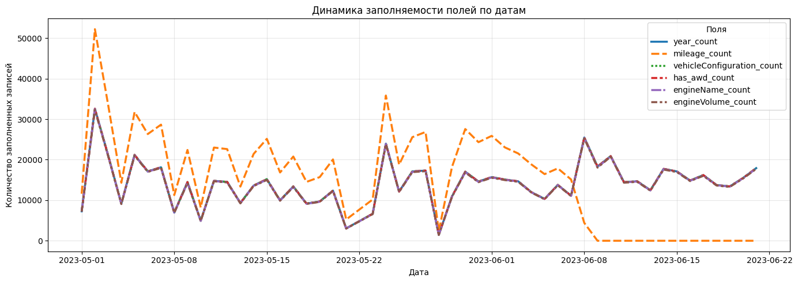
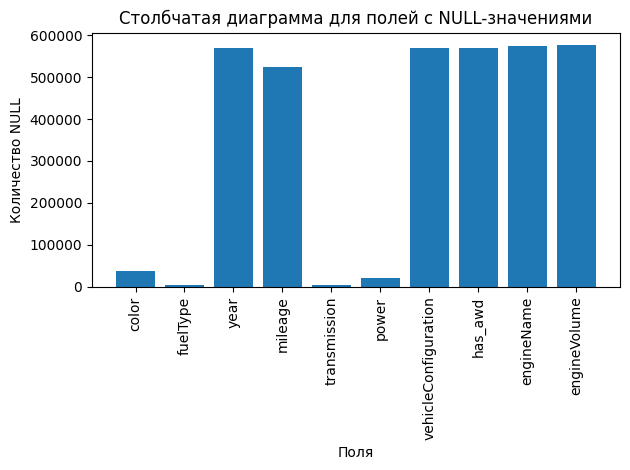
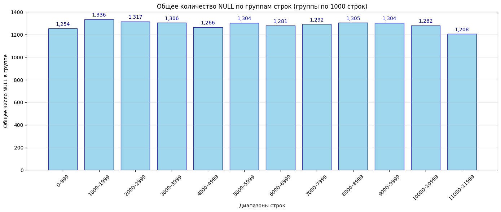
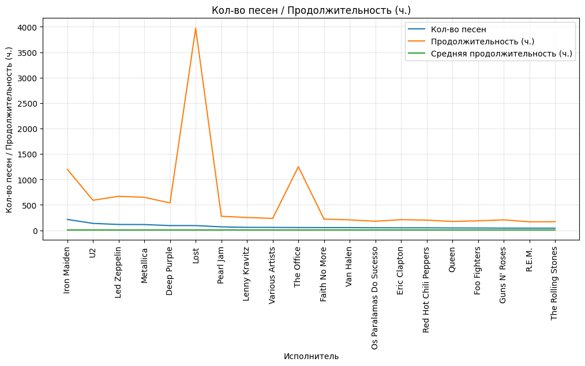
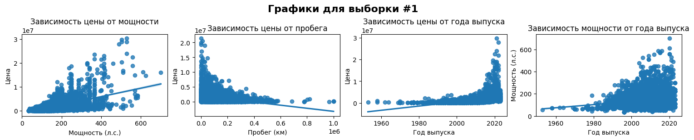
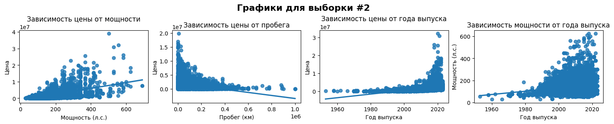
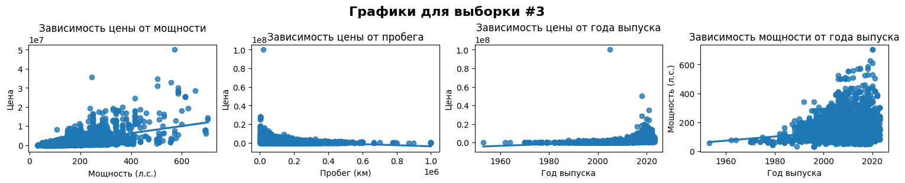

# Описание
## Краткое описание
Приводится пример анализа данных на основе датасета 
[https://www.kaggle.com/datasets/ekibee/car-sales-information](https://www.kaggle.com/datasets/ekibee/car-sales-information)

Данный датасет содержит информацию о продаже машин за определенные годы
по определенным регионам. 

Датасет содежит `1 294 757` записей и `19` параметров.
Общий объем данных `2.14 Gb`.

## Общая схема работы


## Используемые инструменты

| Этап | Сервис | Url | Описание | 
|---------|---------|-----------|---------------|
| `подготовка` | python3, clickhouse-local |  | |
| `data profilling` `визуализация`| JupyterLab | [http://localhost:8888/](http://localhost:8888/) | `Data profiling` — это процесс исследования и анализа наборов данных для понимания их структуры, содержания и качества. Цель — получить полное представление о данных перед их использованием в анализе, машинном обучении или интеграции.  |
| `визуализация` | Apache Superset | [http://localhost:8088/](http://localhost:8088/) | `Apache Superset` — это бесплатная (open‑source) платформа для исследования и визуализации данных с веб‑интерфейсом. Изначально разработана в Airbnb, затем передана в Apache Software Foundation. |
| `хранение` | ClickHouse | [http://localhost:8123/](http://localhost:8123/) | `ClickHouse` — это колоночная (столбцовая) система управления базами данных (СУБД) с открытым исходным кодом (Apache License 2.0), разработанная в Яндексе для аналитики больших объёмов данных в реальном времени. |
| `хранение` | PostgreSQL | [http://localhost:5423/](http://localhost:5423/) |  |
| `визуализация` | PostgreSQL | [http://localhost:5000/](http://localhost:5000/) | `smtp4dev` — это бесплатный open‑source‑инструмент (под лицензией Apache 2.0), эмулирующий SMTP‑сервер для тестирования и отладки отправки писем в процессе разработки.  |

## Как запустить
`docker compose  up --build`

# Работа с `clickhouse-client`
## Описание
В данном проекте для работы с данными используется `clickhouse server` который работает в рамках `docker`. 

Для более быстрого предварительного анализа можно также использвать `clickhouse-local` для 
непосредственной работы с файлаим. 

Для более быстрой работы рекомендуется предварительно конвертировать `csv` и другие текстовые форматы файлов в `parquet` формат. 

## Настройка `docker`
Для того чтобы была возможность работать с файлами данных в `docker` при использвании 
`clickhouse-client` нужно смонтировать локальную папку где лежать данные в `docker`.

По умолчанию `clickhouse` ищет файлы с данными в папке `/var/lib/clickhouse/user_files`.

Для того чтобы работать с локальной папкой с данными в `docker` нужно добавить в `docker-compose.yaml` следующие настройки 

```
volumes:
    - ./datasets:/var/lib/clickhouse/user_files
```
Где `./datasets` относительный или абсолютный путь к папке с данными.

## Создание структуры таблицы из файла

Добавить данные из файла в таблицу можно двумя способами - из локального файла который находится на локальном компьютере либо из файла который смонтирован в `docker`. В первом случае используется относительный пусть к локальному файлу `./datasets/raw_data/cars/cars_sales.csv`. Во втором случае относительный путь к файлу в рамках `docker` - `./raw_data/cars/cars_sales.csv`. Файлы в `docker` находятся в директории `/var/lib/clickhouse/user_files`

Для создания структуры таблицы из файла нужно выполнить следующую последовательность команд. Все команды выполняются на локальном компьютере.

### Создание базы данных если не существует.
```
clickhouse-client -q "CREATE DATABASE IF NOT EXISTS cars;"
```
### Удаление таблицы если существует
```
clickhouse-client -q "DROP TABLE IF EXISTS cars.cars_sales;"
```
### Создание структуры таблицы если не существует (через `docker`) 
```
clickhouse-client -q "CREATE TABLE IF NOT EXISTS cars.cars_sales ENGINE = MergeTree ORDER BY tuple() EMPTY AS SELECT * FROM file('./raw_data/cars/cars_sales.csv');"
```
### Добавление данных в таблицу (локальный файл)
```
clickhouse-client -q "INSERT INTO cars.cars_sales FORMAT CSVWithNames" < ./datasets/raw_data/cars/cars_sales.csv
```
```
5.55s user 4.89s system 46% cpu 22.242 total
```
### Добавление данных в таблицу (через `docker`)
```
clickhouse-client -q "INSERT INTO cars.cars_sales SELECT * FROM file('./raw_data/cars/cars_sales.csv', CSVWithNames)"
```
```
0.05s user 0.03s system 1% cpu 7.224 total
```

# Визуализация

|  |  |  | 
|---------|-----------|---------------|
|  |  |  |
|  |  |
|  |  |

# Jupyter notebook


```python
%load_ext autotime
%matplotlib inline
```

    time: 490 ms (started: 2026-05-30 18:22:21 +03:00)


## Замер времени выполнения


```python
import time

start_time = time.perf_counter()
```

    time: 305 μs (started: 2026-05-30 18:22:22 +03:00)


## Подключаем основные модули


```python
import socket

import clickhouse_connect
import matplotlib.pyplot as plt
import numpy as np
import pandas as pd
import seaborn as sns
from my_module.my_func import (
    get_null_exists_estimation,
    get_uniq_estimation,
    highlight_values,
)

```

    time: 445 ms (started: 2026-05-30 18:22:22 +03:00)


## Объявляем основные переменные
`local_host_name` - локальное имя хоста<br>
`docker_host_name` - docker имя хоста<br>
`sample_percent` - размер выборки в процентах<br>
`sample_count` - кол-во выборок<br>
`db` - база данных<br>
`table` - название таблицы<br>


```python
local_host_name = "home-NMH-WDX9"
docker_host_name = "service.db_clickhouse"

db = "cars"
table = "cars_sales"

sample_percent = 0.01
sample_count = 3
```

    time: 356 μs (started: 2026-05-30 18:22:22 +03:00)


## Подключаемся к база данных `clickhouse`

Подключение к `ClickHouse` через официальный драйвер `clickhouse-connect`.<br>
Если запуск `.ipynb` происходит на локальной машине а не в `docker` то `host = "localhost"`.<br>
Иначе указывается адрес сурвиса в рамках docker - `"service.db_clickhouse"`.

Для корректной работы `home-NMH-WDX9` нужно заменить на имя вашей локальной машины.


```python
hostname = socket.gethostname()
host = docker_host_name
if hostname == local_host_name:
    host = "localhost"

client = clickhouse_connect.get_client(
    host=host, port=8123, username="default", password=""
)
```

    time: 24.1 ms (started: 2026-05-30 18:22:22 +03:00)


## Получаем общее кол-во записей в таблице `car_sales`

Получаем общее кол-во записей в таблице `car_sales`. 

На основании полученной информаци формируем размер выборки `sample_size`. <br>
Размер выборки формируется в зависимости от значения `sample_percent`, которое задается в процентах от общего кол-ва записей в таблице.


```python
sql = f"SELECT COUNT(*) FROM {db}.{table};"  # noqa: S608
result = client.query(sql)
rows_count = result.result_rows[0][0]
sample_size = round(rows_count * sample_percent)
info_dict = {
    "Metric": [
        f"Кол-во записей в таблице {db}.{table}",
        f"Размер выборки ({sample_percent * 100}%)",
    ],
    "Value": [f"{rows_count:_d}", f"{sample_size:_d}"],
}
info_df = pd.DataFrame(info_dict)
info_df
```


<div>

<table border="1" class="dataframe">
  <thead>
    <tr style="text-align: right;">
      <th></th>
      <th>Metric</th>
      <th>Value</th>
    </tr>
  </thead>
  <tbody>
    <tr>
      <th>0</th>
      <td>Кол-во записей в таблице cars.cars_sales</td>
      <td>1_294_757</td>
    </tr>
    <tr>
      <th>1</th>
      <td>Размер выборки (1.0%)</td>
      <td>12_948</td>
    </tr>
  </tbody>
</table>
</div>


    time: 16.3 ms (started: 2026-05-30 18:22:22 +03:00)


## Формирование отчета аналогичного `pandas .info()`


```python
sql = f"DESCRIBE TABLE {db}.{table}"
df_table_columns = client.query_df(sql)

table_columns = df_table_columns["name"].to_list()
df_table_columns.set_index("name", inplace=True)

field_not_null_counts = {}
field_uniq = {}
for column in table_columns:
    sql = f"""SELECT
    uniq(`{column}`) as uniq_count,
    count(*) as non_null_count
    FROM {db}.{table}
    WHERE `{column}` IS NOT NULL;"""  # noqa: S608

    q = client.query(sql)
    field_not_null_counts[column] = q.result_rows[0][1]
    field_uniq[column] = q.result_rows[0][0]


df_uniq = pd.DataFrame.from_dict(field_uniq, orient="index", columns=["Uniq Count"])
df_uniq["Uniq Count %"] = round((df_uniq["Uniq Count"] * 100) / rows_count, 2)

df_non_null = pd.DataFrame.from_dict(
    field_not_null_counts, orient="index", columns=["Non-Null Count"]
)
df_non_null["Null Count"] = rows_count - df_non_null["Non-Null Count"]
df_non_null["Null Count %"] = round((df_non_null["Null Count"] * 100) / rows_count, 2)
df_non_null["Description Null"] = df_non_null.apply(
    lambda row: get_null_exists_estimation(row, 30), axis=1
)

df_rez_null_count = (
    pd
    .concat([df_table_columns, df_uniq, df_non_null], axis=1)
    .reset_index()
    .rename(columns={"index": "field"})
)

df_rez_null_count["Description Uniq"] = df_rez_null_count.apply(
    lambda row: get_uniq_estimation(row, 10), axis=1
)

df_rez_null_count = df_rez_null_count[
    [
        "field",
        "type",
        "Uniq Count",
        "Uniq Count %",
        "Description Uniq",
        "Non-Null Count",
        "Null Count",
        "Null Count %",
        "Description Null",
    ]
]

rez_styled = df_rez_null_count.style.apply(
    lambda row: highlight_values(row, threshold_null=30, threshold_uniq=10), axis=1
).format({"Null Count %": "{:.2f}", "Uniq Count %": "{:.2f}"})

rez_styled

```


<table id="T_4e972">
  <thead>
    <tr>
      <th class="blank level0" >&nbsp;</th>
      <th id="T_4e972_level0_col0" class="col_heading level0 col0" >field</th>
      <th id="T_4e972_level0_col1" class="col_heading level0 col1" >type</th>
      <th id="T_4e972_level0_col2" class="col_heading level0 col2" >Uniq Count</th>
      <th id="T_4e972_level0_col3" class="col_heading level0 col3" >Uniq Count %</th>
      <th id="T_4e972_level0_col4" class="col_heading level0 col4" >Description Uniq</th>
      <th id="T_4e972_level0_col5" class="col_heading level0 col5" >Non-Null Count</th>
      <th id="T_4e972_level0_col6" class="col_heading level0 col6" >Null Count</th>
      <th id="T_4e972_level0_col7" class="col_heading level0 col7" >Null Count %</th>
      <th id="T_4e972_level0_col8" class="col_heading level0 col8" >Description Null</th>
    </tr>
  </thead>
  <tbody>
    <tr>
      <th id="T_4e972_level0_row0" class="row_heading level0 row0" >0</th>
      <td id="T_4e972_row0_col0" class="data row0 col0" >brand</td>
      <td id="T_4e972_row0_col1" class="data row0 col1" >Nullable(String)</td>
      <td id="T_4e972_row0_col2" class="data row0 col2" >160</td>
      <td id="T_4e972_row0_col3" class="data row0 col3" >0.01</td>
      <td id="T_4e972_row0_col4" class="data row0 col4" >LowCardinality</td>
      <td id="T_4e972_row0_col5" class="data row0 col5" >1294757</td>
      <td id="T_4e972_row0_col6" class="data row0 col6" >0</td>
      <td id="T_4e972_row0_col7" class="data row0 col7" >0.00</td>
      <td id="T_4e972_row0_col8" class="data row0 col8" ></td>
    </tr>
    <tr>
      <th id="T_4e972_level0_row1" class="row_heading level0 row1" >1</th>
      <td id="T_4e972_row1_col0" class="data row1 col0" >name</td>
      <td id="T_4e972_row1_col1" class="data row1 col1" >Nullable(String)</td>
      <td id="T_4e972_row1_col2" class="data row1 col2" >2223</td>
      <td id="T_4e972_row1_col3" class="data row1 col3" >0.17</td>
      <td id="T_4e972_row1_col4" class="data row1 col4" >LowCardinality</td>
      <td id="T_4e972_row1_col5" class="data row1 col5" >1294757</td>
      <td id="T_4e972_row1_col6" class="data row1 col6" >0</td>
      <td id="T_4e972_row1_col7" class="data row1 col7" >0.00</td>
      <td id="T_4e972_row1_col8" class="data row1 col8" ></td>
    </tr>
    <tr>
      <th id="T_4e972_level0_row2" class="row_heading level0 row2" >2</th>
      <td id="T_4e972_row2_col0" class="data row2 col0" >bodyType</td>
      <td id="T_4e972_row2_col1" class="data row2 col1" >Nullable(String)</td>
      <td id="T_4e972_row2_col2" class="data row2 col2" >11</td>
      <td id="T_4e972_row2_col3" class="data row2 col3" >0.00</td>
      <td id="T_4e972_row2_col4" class="data row2 col4" >LowCardinality</td>
      <td id="T_4e972_row2_col5" class="data row2 col5" >1294757</td>
      <td id="T_4e972_row2_col6" class="data row2 col6" >0</td>
      <td id="T_4e972_row2_col7" class="data row2 col7" >0.00</td>
      <td id="T_4e972_row2_col8" class="data row2 col8" ></td>
    </tr>
    <tr>
      <th id="T_4e972_level0_row3" class="row_heading level0 row3" >3</th>
      <td id="T_4e972_row3_col0" class="data row3 col0" >color</td>
      <td id="T_4e972_row3_col1" class="data row3 col1" >LowCardinality(Nullable(String))</td>
      <td id="T_4e972_row3_col2" class="data row3 col2" >16</td>
      <td id="T_4e972_row3_col3" class="data row3 col3" >0.00</td>
      <td id="T_4e972_row3_col4" class="data row3 col4" >LowCardinality</td>
      <td id="T_4e972_row3_col5" class="data row3 col5" >1257029</td>
      <td id="T_4e972_row3_col6" class="data row3 col6" >37728</td>
      <td id="T_4e972_row3_col7" class="data row3 col7" >2.91</td>
      <td id="T_4e972_row3_col8" class="data row3 col8" >Мало</td>
    </tr>
    <tr>
      <th id="T_4e972_level0_row4" class="row_heading level0 row4" >4</th>
      <td id="T_4e972_row4_col0" class="data row4 col0" >fuelType</td>
      <td id="T_4e972_row4_col1" class="data row4 col1" >LowCardinality(Nullable(String))</td>
      <td id="T_4e972_row4_col2" class="data row4 col2" >3</td>
      <td id="T_4e972_row4_col3" class="data row4 col3" >0.00</td>
      <td id="T_4e972_row4_col4" class="data row4 col4" >LowCardinality</td>
      <td id="T_4e972_row4_col5" class="data row4 col5" >1289815</td>
      <td id="T_4e972_row4_col6" class="data row4 col6" >4942</td>
      <td id="T_4e972_row4_col7" class="data row4 col7" >0.38</td>
      <td id="T_4e972_row4_col8" class="data row4 col8" >Мало</td>
    </tr>
    <tr>
      <th id="T_4e972_level0_row5" class="row_heading level0 row5" >5</th>
      <td id="T_4e972_row5_col0" class="data row5 col0" >year</td>
      <td id="T_4e972_row5_col1" class="data row5 col1" >Nullable(UInt16)</td>
      <td id="T_4e972_row5_col2" class="data row5 col2" >78</td>
      <td id="T_4e972_row5_col3" class="data row5 col3" >0.01</td>
      <td id="T_4e972_row5_col4" class="data row5 col4" ></td>
      <td id="T_4e972_row5_col5" class="data row5 col5" >724644</td>
      <td id="T_4e972_row5_col6" class="data row5 col6" >570113</td>
      <td id="T_4e972_row5_col7" class="data row5 col7" >44.03</td>
      <td id="T_4e972_row5_col8" class="data row5 col8" >Много</td>
    </tr>
    <tr>
      <th id="T_4e972_level0_row6" class="row_heading level0 row6" >6</th>
      <td id="T_4e972_row6_col0" class="data row6 col0" >mileage</td>
      <td id="T_4e972_row6_col1" class="data row6 col1" >Nullable(UInt32)</td>
      <td id="T_4e972_row6_col2" class="data row6 col2" >821</td>
      <td id="T_4e972_row6_col3" class="data row6 col3" >0.06</td>
      <td id="T_4e972_row6_col4" class="data row6 col4" ></td>
      <td id="T_4e972_row6_col5" class="data row6 col5" >771799</td>
      <td id="T_4e972_row6_col6" class="data row6 col6" >522958</td>
      <td id="T_4e972_row6_col7" class="data row6 col7" >40.39</td>
      <td id="T_4e972_row6_col8" class="data row6 col8" >Много</td>
    </tr>
    <tr>
      <th id="T_4e972_level0_row7" class="row_heading level0 row7" >7</th>
      <td id="T_4e972_row7_col0" class="data row7 col0" >transmission</td>
      <td id="T_4e972_row7_col1" class="data row7 col1" >LowCardinality(Nullable(String))</td>
      <td id="T_4e972_row7_col2" class="data row7 col2" >4</td>
      <td id="T_4e972_row7_col3" class="data row7 col3" >0.00</td>
      <td id="T_4e972_row7_col4" class="data row7 col4" >LowCardinality</td>
      <td id="T_4e972_row7_col5" class="data row7 col5" >1289563</td>
      <td id="T_4e972_row7_col6" class="data row7 col6" >5194</td>
      <td id="T_4e972_row7_col7" class="data row7 col7" >0.40</td>
      <td id="T_4e972_row7_col8" class="data row7 col8" >Мало</td>
    </tr>
    <tr>
      <th id="T_4e972_level0_row8" class="row_heading level0 row8" >8</th>
      <td id="T_4e972_row8_col0" class="data row8 col0" >power</td>
      <td id="T_4e972_row8_col1" class="data row8 col1" >Nullable(UInt16)</td>
      <td id="T_4e972_row8_col2" class="data row8 col2" >541</td>
      <td id="T_4e972_row8_col3" class="data row8 col3" >0.04</td>
      <td id="T_4e972_row8_col4" class="data row8 col4" ></td>
      <td id="T_4e972_row8_col5" class="data row8 col5" >1273353</td>
      <td id="T_4e972_row8_col6" class="data row8 col6" >21404</td>
      <td id="T_4e972_row8_col7" class="data row8 col7" >1.65</td>
      <td id="T_4e972_row8_col8" class="data row8 col8" >Мало</td>
    </tr>
    <tr>
      <th id="T_4e972_level0_row9" class="row_heading level0 row9" >9</th>
      <td id="T_4e972_row9_col0" class="data row9 col0" >price</td>
      <td id="T_4e972_row9_col1" class="data row9 col1" >UInt32</td>
      <td id="T_4e972_row9_col2" class="data row9 col2" >35134</td>
      <td id="T_4e972_row9_col3" class="data row9 col3" >2.71</td>
      <td id="T_4e972_row9_col4" class="data row9 col4" ></td>
      <td id="T_4e972_row9_col5" class="data row9 col5" >1294757</td>
      <td id="T_4e972_row9_col6" class="data row9 col6" >0</td>
      <td id="T_4e972_row9_col7" class="data row9 col7" >0.00</td>
      <td id="T_4e972_row9_col8" class="data row9 col8" ></td>
    </tr>
    <tr>
      <th id="T_4e972_level0_row10" class="row_heading level0 row10" >10</th>
      <td id="T_4e972_row10_col0" class="data row10 col0" >vehicleConfiguration</td>
      <td id="T_4e972_row10_col1" class="data row10 col1" >LowCardinality(Nullable(String))</td>
      <td id="T_4e972_row10_col2" class="data row10 col2" >25517</td>
      <td id="T_4e972_row10_col3" class="data row10 col3" >1.97</td>
      <td id="T_4e972_row10_col4" class="data row10 col4" >LowCardinality</td>
      <td id="T_4e972_row10_col5" class="data row10 col5" >724647</td>
      <td id="T_4e972_row10_col6" class="data row10 col6" >570110</td>
      <td id="T_4e972_row10_col7" class="data row10 col7" >44.03</td>
      <td id="T_4e972_row10_col8" class="data row10 col8" >Много</td>
    </tr>
    <tr>
      <th id="T_4e972_level0_row11" class="row_heading level0 row11" >11</th>
      <td id="T_4e972_row11_col0" class="data row11 col0" >has_awd</td>
      <td id="T_4e972_row11_col1" class="data row11 col1" >Nullable(Bool)</td>
      <td id="T_4e972_row11_col2" class="data row11 col2" >2</td>
      <td id="T_4e972_row11_col3" class="data row11 col3" >0.00</td>
      <td id="T_4e972_row11_col4" class="data row11 col4" ></td>
      <td id="T_4e972_row11_col5" class="data row11 col5" >724647</td>
      <td id="T_4e972_row11_col6" class="data row11 col6" >570110</td>
      <td id="T_4e972_row11_col7" class="data row11 col7" >44.03</td>
      <td id="T_4e972_row11_col8" class="data row11 col8" >Много</td>
    </tr>
    <tr>
      <th id="T_4e972_level0_row12" class="row_heading level0 row12" >12</th>
      <td id="T_4e972_row12_col0" class="data row12 col0" >engineName</td>
      <td id="T_4e972_row12_col1" class="data row12 col1" >LowCardinality(Nullable(String))</td>
      <td id="T_4e972_row12_col2" class="data row12 col2" >4185</td>
      <td id="T_4e972_row12_col3" class="data row12 col3" >0.32</td>
      <td id="T_4e972_row12_col4" class="data row12 col4" >LowCardinality</td>
      <td id="T_4e972_row12_col5" class="data row12 col5" >720976</td>
      <td id="T_4e972_row12_col6" class="data row12 col6" >573781</td>
      <td id="T_4e972_row12_col7" class="data row12 col7" >44.32</td>
      <td id="T_4e972_row12_col8" class="data row12 col8" >Много</td>
    </tr>
    <tr>
      <th id="T_4e972_level0_row13" class="row_heading level0 row13" >13</th>
      <td id="T_4e972_row13_col0" class="data row13 col0" >engineVolume</td>
      <td id="T_4e972_row13_col1" class="data row13 col1" >Nullable(Float32)</td>
      <td id="T_4e972_row13_col2" class="data row13 col2" >69</td>
      <td id="T_4e972_row13_col3" class="data row13 col3" >0.01</td>
      <td id="T_4e972_row13_col4" class="data row13 col4" ></td>
      <td id="T_4e972_row13_col5" class="data row13 col5" >717625</td>
      <td id="T_4e972_row13_col6" class="data row13 col6" >577132</td>
      <td id="T_4e972_row13_col7" class="data row13 col7" >44.57</td>
      <td id="T_4e972_row13_col8" class="data row13 col8" >Много</td>
    </tr>
    <tr>
      <th id="T_4e972_level0_row14" class="row_heading level0 row14" >14</th>
      <td id="T_4e972_row14_col0" class="data row14 col0" >date</td>
      <td id="T_4e972_row14_col1" class="data row14 col1" >Date</td>
      <td id="T_4e972_row14_col2" class="data row14 col2" >84</td>
      <td id="T_4e972_row14_col3" class="data row14 col3" >0.01</td>
      <td id="T_4e972_row14_col4" class="data row14 col4" ></td>
      <td id="T_4e972_row14_col5" class="data row14 col5" >1294757</td>
      <td id="T_4e972_row14_col6" class="data row14 col6" >0</td>
      <td id="T_4e972_row14_col7" class="data row14 col7" >0.00</td>
      <td id="T_4e972_row14_col8" class="data row14 col8" ></td>
    </tr>
    <tr>
      <th id="T_4e972_level0_row15" class="row_heading level0 row15" >15</th>
      <td id="T_4e972_row15_col0" class="data row15 col0" >location</td>
      <td id="T_4e972_row15_col1" class="data row15 col1" >LowCardinality(Nullable(String))</td>
      <td id="T_4e972_row15_col2" class="data row15 col2" >3400</td>
      <td id="T_4e972_row15_col3" class="data row15 col3" >0.26</td>
      <td id="T_4e972_row15_col4" class="data row15 col4" >LowCardinality</td>
      <td id="T_4e972_row15_col5" class="data row15 col5" >1294757</td>
      <td id="T_4e972_row15_col6" class="data row15 col6" >0</td>
      <td id="T_4e972_row15_col7" class="data row15 col7" >0.00</td>
      <td id="T_4e972_row15_col8" class="data row15 col8" ></td>
    </tr>
    <tr>
      <th id="T_4e972_level0_row16" class="row_heading level0 row16" >16</th>
      <td id="T_4e972_row16_col0" class="data row16 col0" >parse_date</td>
      <td id="T_4e972_row16_col1" class="data row16 col1" >DateTime</td>
      <td id="T_4e972_row16_col2" class="data row16 col2" >817</td>
      <td id="T_4e972_row16_col3" class="data row16 col3" >0.06</td>
      <td id="T_4e972_row16_col4" class="data row16 col4" ></td>
      <td id="T_4e972_row16_col5" class="data row16 col5" >1294757</td>
      <td id="T_4e972_row16_col6" class="data row16 col6" >0</td>
      <td id="T_4e972_row16_col7" class="data row16 col7" >0.00</td>
      <td id="T_4e972_row16_col8" class="data row16 col8" ></td>
    </tr>
  </tbody>
</table>


    time: 280 ms (started: 2026-05-30 18:23:26 +03:00)


## Кол-во Null значений от общего кол-ва значений


```python
n = df_rez_null_count["Null Count"].sum()
null_dict = {
    "Null Values Count": n,
    "All Values Count": rows_count * len(df_rez_null_count),
    "Percent (%)": (n * 100) / (rows_count * len(df_rez_null_count)),
}
null_dict_df = pd.DataFrame(null_dict, index=[0])
null_dict_df
```


<div>

<table border="1" class="dataframe">
  <thead>
    <tr style="text-align: right;">
      <th></th>
      <th>Null Values Count</th>
      <th>All Values Count</th>
      <th>Percent (%)</th>
    </tr>
  </thead>
  <tbody>
    <tr>
      <th>0</th>
      <td>3453472</td>
      <td>22010869</td>
      <td>15.689849</td>
    </tr>
  </tbody>
</table>
</div>


    time: 8.51 ms (started: 2026-05-30 18:22:23 +03:00)


```python
fields_with_null = df_rez_null_count[df_rez_null_count["Null Count %"] > 30][
    "field"
].to_list()
rrr = {}
for field in fields_with_null:
    sql = f"""SELECT
    toDate(parse_date) as date,
    count({field}) as {field}_count
    FROM {db}.{table}
    GROUP BY toDate(parse_date)
    ORDER BY toDate(parse_date)
    """  # noqa: S608
    df = client.query_df(sql).set_index("date")
    rrr[field] = df

result = pd.concat(list(rrr.values()), axis=1)
result.reset_index(inplace=True)
result.head()
```


<div>

<table border="1" class="dataframe">
  <thead>
    <tr style="text-align: right;">
      <th></th>
      <th>date</th>
      <th>year_count</th>
      <th>mileage_count</th>
      <th>vehicleConfiguration_count</th>
      <th>has_awd_count</th>
      <th>engineName_count</th>
      <th>engineVolume_count</th>
    </tr>
  </thead>
  <tbody>
    <tr>
      <th>0</th>
      <td>2023-05-01</td>
      <td>7259</td>
      <td>11606</td>
      <td>7259</td>
      <td>7259</td>
      <td>7224</td>
      <td>7196</td>
    </tr>
    <tr>
      <th>1</th>
      <td>2023-05-02</td>
      <td>32574</td>
      <td>52196</td>
      <td>32574</td>
      <td>32574</td>
      <td>32446</td>
      <td>32294</td>
    </tr>
    <tr>
      <th>2</th>
      <td>2023-05-03</td>
      <td>21091</td>
      <td>33546</td>
      <td>21091</td>
      <td>21091</td>
      <td>20984</td>
      <td>20882</td>
    </tr>
    <tr>
      <th>3</th>
      <td>2023-05-04</td>
      <td>9147</td>
      <td>14306</td>
      <td>9147</td>
      <td>9147</td>
      <td>9087</td>
      <td>9057</td>
    </tr>
    <tr>
      <th>4</th>
      <td>2023-05-05</td>
      <td>21184</td>
      <td>31772</td>
      <td>21184</td>
      <td>21184</td>
      <td>21099</td>
      <td>20998</td>
    </tr>
  </tbody>
</table>
</div>


    time: 166 ms (started: 2026-05-30 18:22:23 +03:00)


```python
plt.figure(figsize=(14, 5))
sns.lineplot(data=result.set_index("date"), linewidth=2.5)
plt.title("Динамика заполняемости полей по датам")
plt.xlabel("Дата")
plt.ylabel("Количество заполненных записей")
plt.xticks(rotation=0)
plt.legend(title="Поля")
plt.grid(True, alpha=0.3)
plt.tight_layout()
plt.show()
```


    

    


    time: 279 ms (started: 2026-05-30 18:22:23 +03:00)


```python
filtered_data = df_rez_null_count[df_rez_null_count["Null Count"] > 0]
plt.bar(filtered_data["field"], filtered_data["Null Count"])

plt.title("Столбчатая диаграмма для полей с NULL-значениями")
plt.xlabel("Поля")
plt.ylabel("Количество NULL")
plt.xticks(rotation=90)
plt.tight_layout()
plt.show()

```


    

    


    time: 144 ms (started: 2026-05-30 18:22:23 +03:00)


## Формирование отчета аналогичного `pandas .describe()`


```python
sql = f"""SELECT name
FROM system.columns
WHERE database = '{db}'
  AND table = '{table}'
  AND (
    type LIKE '%Int%' OR
    type LIKE '%UInt%' OR
    type LIKE '%Float%' OR
    type LIKE '%Decimal%'
  )
ORDER BY name;"""  # noqa: S608
result = client.query_df(sql)
columns_numeric = result["name"].to_list()

agg_funcs = {
    "count": "count",
    "mean": "avg",
    "std": "stddevPop",
    "min": "min",
    "25%": "quantile(0.25)",
    "50%": "quantile(0.50)",
    "75%": "quantile(0.75)",
    "max": "max",
}
totals = {}
for column in columns_numeric:
    totals[f"total_{column}"] = {}
    for key, func in agg_funcs.items():
        sql = f"""SELECT {func}({column}) FROM {db}.{table};"""  # noqa: S608
        result = client.query(sql)
        totals[f"total_{column}"].setdefault(key, 0)
        totals[f"total_{column}"][key] = result.result_rows[0][0]
totals_df = pd.DataFrame(totals)
with pd.option_context(
    "display.float_format",
    "{:.2f}".format,
    "display.expand_frame_repr",
    False,
):
    display(totals_df)

```


<div>

<table border="1" class="dataframe">
  <thead>
    <tr style="text-align: right;">
      <th></th>
      <th>total_engineVolume</th>
      <th>total_mileage</th>
      <th>total_power</th>
      <th>total_price</th>
      <th>total_year</th>
    </tr>
  </thead>
  <tbody>
    <tr>
      <th>count</th>
      <td>717625.00</td>
      <td>771799.00</td>
      <td>1273353.00</td>
      <td>1294757.00</td>
      <td>724644.00</td>
    </tr>
    <tr>
      <th>mean</th>
      <td>1.95</td>
      <td>154893.40</td>
      <td>141.56</td>
      <td>1444357.82</td>
      <td>2009.68</td>
    </tr>
    <tr>
      <th>std</th>
      <td>0.76</td>
      <td>100738.27</td>
      <td>65.64</td>
      <td>1970256.65</td>
      <td>9.37</td>
    </tr>
    <tr>
      <th>min</th>
      <td>0.50</td>
      <td>1000.00</td>
      <td>1.00</td>
      <td>270.00</td>
      <td>1936.00</td>
    </tr>
    <tr>
      <th>25%</th>
      <td>1.50</td>
      <td>80000.00</td>
      <td>98.00</td>
      <td>468750.00</td>
      <td>2004.00</td>
    </tr>
    <tr>
      <th>50%</th>
      <td>1.70</td>
      <td>141000.00</td>
      <td>125.00</td>
      <td>955000.00</td>
      <td>2011.00</td>
    </tr>
    <tr>
      <th>75%</th>
      <td>2.00</td>
      <td>212000.00</td>
      <td>160.00</td>
      <td>2099000.00</td>
      <td>2017.00</td>
    </tr>
    <tr>
      <th>max</th>
      <td>8.40</td>
      <td>1000000.00</td>
      <td>1000.00</td>
      <td>150000000.00</td>
      <td>2023.00</td>
    </tr>
  </tbody>
</table>
</div>


    time: 410 ms (started: 2026-05-30 18:22:23 +03:00)


## Формирование нескольких выборок для формирования отчета аналогичного `pandas .describe()`
Для очень большого набора данных может быть выгоднее сформировать отчет на выборке данных и по результатам анализа судить о положении дел в выборке в целом. 

В данном примере мы разбиваем исходный набор данных на `sample_count` диапазонов из которых впоследствии выбираем `sample_size` данных.


```python
cars_columns2 = table_columns.copy()
# cars_columns2.remove("link")
# cars_columns2.remove("description")

dfs = []
sample_count = 3
sql = f"""
WITH ranked AS (
    SELECT
        {",".join(cars_columns2)},
        NTILE({sample_count}) OVER (ORDER BY rand()) AS tile
    FROM {db}.{table}
),
ranked_with_row_num AS (
    SELECT
        *,
        ROW_NUMBER() OVER (PARTITION BY tile ORDER BY rand()) AS row_num
    FROM ranked
)
SELECT *
FROM ranked_with_row_num
WHERE row_num <= {sample_size}
"""  # noqa: S608
df = client.query_df(sql)
df_renamed = df.rename(
    columns={"engineDisplacement": "ED", "vehicleConfiguration": "VC"}
)

for group_id in range(1, sample_count + 1):
    dfs.append(df_renamed[df_renamed["tile"] == group_id])  # noqa: PERF401

```

    time: 3.75 s (started: 2026-05-30 18:22:24 +03:00)


```python
dfs[0].sample(5)
```


<div>

<table border="1" class="dataframe">
  <thead>
    <tr style="text-align: right;">
      <th></th>
      <th>brand</th>
      <th>name</th>
      <th>bodyType</th>
      <th>color</th>
      <th>fuelType</th>
      <th>year</th>
      <th>mileage</th>
      <th>transmission</th>
      <th>power</th>
      <th>price</th>
      <th>VC</th>
      <th>has_awd</th>
      <th>engineName</th>
      <th>engineVolume</th>
      <th>date</th>
      <th>location</th>
      <th>parse_date</th>
      <th>tile</th>
      <th>row_num</th>
    </tr>
  </thead>
  <tbody>
    <tr>
      <th>38183</th>
      <td>Toyota</td>
      <td>Harrier</td>
      <td>Джип 5 дв.</td>
      <td>Белый</td>
      <td>Бензин</td>
      <td>2017</td>
      <td>9000</td>
      <td>Вариатор</td>
      <td>151</td>
      <td>2300000</td>
      <td>2.0 Premium Metal and Leather Package</td>
      <td>False</td>
      <td>3ZR-FAE</td>
      <td>2.0</td>
      <td>2023-05-01</td>
      <td>Якутск</td>
      <td>2023-05-06 00:00:00</td>
      <td>1</td>
      <td>12288</td>
    </tr>
    <tr>
      <th>38290</th>
      <td>Volkswagen</td>
      <td>Touareg</td>
      <td>Джип 5 дв.</td>
      <td>Коричневый</td>
      <td>Бензин</td>
      <td>&lt;NA&gt;</td>
      <td>122000</td>
      <td>АКПП</td>
      <td>249</td>
      <td>1997000</td>
      <td>&lt;NA&gt;</td>
      <td>None</td>
      <td>&lt;NA&gt;</td>
      <td>NaN</td>
      <td>2023-05-29</td>
      <td>Москва</td>
      <td>2023-05-29 23:00:00</td>
      <td>1</td>
      <td>12395</td>
    </tr>
    <tr>
      <th>36870</th>
      <td>Toyota</td>
      <td>Kluger V</td>
      <td>Джип 5 дв.</td>
      <td>Белый</td>
      <td>Бензин</td>
      <td>2000</td>
      <td>1000</td>
      <td>АКПП</td>
      <td>160</td>
      <td>780000</td>
      <td>2.4 V</td>
      <td>False</td>
      <td>2AZ-FE</td>
      <td>2.4</td>
      <td>2023-05-31</td>
      <td>Улан-Удэ</td>
      <td>2023-05-31 08:00:00</td>
      <td>1</td>
      <td>10975</td>
    </tr>
    <tr>
      <th>31705</th>
      <td>Nissan</td>
      <td>AD</td>
      <td>Универсал</td>
      <td>Белый</td>
      <td>Бензин</td>
      <td>&lt;NA&gt;</td>
      <td>&lt;NA&gt;</td>
      <td>АКПП</td>
      <td>100</td>
      <td>185000</td>
      <td>&lt;NA&gt;</td>
      <td>None</td>
      <td>&lt;NA&gt;</td>
      <td>NaN</td>
      <td>2023-06-21</td>
      <td>Омск</td>
      <td>2023-06-21 18:00:00</td>
      <td>1</td>
      <td>5810</td>
    </tr>
    <tr>
      <th>26712</th>
      <td>Mitsubishi</td>
      <td>Outlander</td>
      <td>Джип 5 дв.</td>
      <td>Черный</td>
      <td>Бензин</td>
      <td>&lt;NA&gt;</td>
      <td>411000</td>
      <td>Вариатор</td>
      <td>170</td>
      <td>965000</td>
      <td>&lt;NA&gt;</td>
      <td>None</td>
      <td>&lt;NA&gt;</td>
      <td>NaN</td>
      <td>2023-05-05</td>
      <td>Москва</td>
      <td>2023-05-05 15:00:00</td>
      <td>1</td>
      <td>817</td>
    </tr>
  </tbody>
</table>
</div>


    time: 12.4 ms (started: 2026-05-30 18:22:28 +03:00)


## Получение описательной статистики по выборкам


```python
fields = columns_numeric  # ["price", "power", "year"]
descs = []
descs.append(totals_df)
for i in range(sample_count):
    desc = dfs[i][fields].describe()
    desc.columns = [f"df{i + 1}_{col}" for col in desc.columns]
    descs.append(desc)

combined_desc = pd.concat(descs, axis=1)

with pd.option_context(
    "display.float_format",
    "{:.2f}".format,
    "display.expand_frame_repr",
    False,
):
    display(combined_desc)

```


<div>

<table border="1" class="dataframe">
  <thead>
    <tr style="text-align: right;">
      <th></th>
      <th>total_engineVolume</th>
      <th>total_mileage</th>
      <th>total_power</th>
      <th>total_price</th>
      <th>total_year</th>
      <th>df1_engineVolume</th>
      <th>df1_mileage</th>
      <th>df1_power</th>
      <th>df1_price</th>
      <th>df1_year</th>
      <th>df2_engineVolume</th>
      <th>df2_mileage</th>
      <th>df2_power</th>
      <th>df2_price</th>
      <th>df2_year</th>
      <th>df3_engineVolume</th>
      <th>df3_mileage</th>
      <th>df3_power</th>
      <th>df3_price</th>
      <th>df3_year</th>
    </tr>
  </thead>
  <tbody>
    <tr>
      <th>count</th>
      <td>717625.00</td>
      <td>771799.00</td>
      <td>1273353.00</td>
      <td>1294757.00</td>
      <td>724644.00</td>
      <td>7247.00</td>
      <td>7793.00</td>
      <td>12756.00</td>
      <td>12948.00</td>
      <td>7311.00</td>
      <td>7200.00</td>
      <td>7774.00</td>
      <td>12719.00</td>
      <td>12948.00</td>
      <td>7271.00</td>
      <td>7168.00</td>
      <td>7701.00</td>
      <td>12733.00</td>
      <td>12948.00</td>
      <td>7231.00</td>
    </tr>
    <tr>
      <th>mean</th>
      <td>1.95</td>
      <td>154893.40</td>
      <td>141.56</td>
      <td>1444357.82</td>
      <td>2009.68</td>
      <td>1.95</td>
      <td>155451.69</td>
      <td>140.87</td>
      <td>1410442.02</td>
      <td>2009.46</td>
      <td>1.97</td>
      <td>155972.99</td>
      <td>142.57</td>
      <td>1442499.13</td>
      <td>2009.73</td>
      <td>1.96</td>
      <td>156088.43</td>
      <td>141.57</td>
      <td>1464307.10</td>
      <td>2009.60</td>
    </tr>
    <tr>
      <th>std</th>
      <td>0.76</td>
      <td>100738.27</td>
      <td>65.64</td>
      <td>1970256.65</td>
      <td>9.37</td>
      <td>0.77</td>
      <td>101787.10</td>
      <td>64.03</td>
      <td>1859575.82</td>
      <td>9.43</td>
      <td>0.75</td>
      <td>102375.79</td>
      <td>65.65</td>
      <td>1897564.57</td>
      <td>9.29</td>
      <td>0.76</td>
      <td>103233.83</td>
      <td>66.94</td>
      <td>2212324.01</td>
      <td>9.18</td>
    </tr>
    <tr>
      <th>min</th>
      <td>0.50</td>
      <td>1000.00</td>
      <td>1.00</td>
      <td>270.00</td>
      <td>1936.00</td>
      <td>0.50</td>
      <td>1000.00</td>
      <td>33.00</td>
      <td>23000.00</td>
      <td>1953.00</td>
      <td>0.60</td>
      <td>1000.00</td>
      <td>27.00</td>
      <td>6000.00</td>
      <td>1953.00</td>
      <td>0.60</td>
      <td>1000.00</td>
      <td>30.00</td>
      <td>10000.00</td>
      <td>1953.00</td>
    </tr>
    <tr>
      <th>25%</th>
      <td>1.50</td>
      <td>80000.00</td>
      <td>98.00</td>
      <td>468750.00</td>
      <td>2004.00</td>
      <td>1.50</td>
      <td>80000.00</td>
      <td>98.00</td>
      <td>400000.00</td>
      <td>2003.00</td>
      <td>1.50</td>
      <td>82000.00</td>
      <td>98.00</td>
      <td>428500.00</td>
      <td>2004.00</td>
      <td>1.50</td>
      <td>83000.00</td>
      <td>98.00</td>
      <td>425000.00</td>
      <td>2003.00</td>
    </tr>
    <tr>
      <th>50%</th>
      <td>1.70</td>
      <td>141000.00</td>
      <td>125.00</td>
      <td>955000.00</td>
      <td>2011.00</td>
      <td>1.70</td>
      <td>145000.00</td>
      <td>128.00</td>
      <td>865000.00</td>
      <td>2011.00</td>
      <td>1.80</td>
      <td>146000.00</td>
      <td>129.00</td>
      <td>870000.00</td>
      <td>2011.00</td>
      <td>1.70</td>
      <td>143000.00</td>
      <td>128.00</td>
      <td>870000.00</td>
      <td>2011.00</td>
    </tr>
    <tr>
      <th>75%</th>
      <td>2.00</td>
      <td>212000.00</td>
      <td>160.00</td>
      <td>2099000.00</td>
      <td>2017.00</td>
      <td>2.00</td>
      <td>211000.00</td>
      <td>160.00</td>
      <td>1720000.00</td>
      <td>2017.00</td>
      <td>2.10</td>
      <td>214000.00</td>
      <td>167.00</td>
      <td>1750000.00</td>
      <td>2017.00</td>
      <td>2.00</td>
      <td>211000.00</td>
      <td>163.00</td>
      <td>1750000.00</td>
      <td>2017.00</td>
    </tr>
    <tr>
      <th>max</th>
      <td>8.40</td>
      <td>1000000.00</td>
      <td>1000.00</td>
      <td>150000000.00</td>
      <td>2023.00</td>
      <td>6.70</td>
      <td>1000000.00</td>
      <td>702.00</td>
      <td>30500000.00</td>
      <td>2023.00</td>
      <td>6.40</td>
      <td>1000000.00</td>
      <td>693.00</td>
      <td>39000000.00</td>
      <td>2023.00</td>
      <td>6.70</td>
      <td>1000000.00</td>
      <td>702.00</td>
      <td>99999999.00</td>
      <td>2023.00</td>
    </tr>
  </tbody>
</table>
</div>


    time: 50 ms (started: 2026-05-30 18:22:28 +03:00)


## Сравнение описательной статистики по выборкам с общими данными на предмет наличия/отсутствия существенных расхождений


```python
new_df = totals_df.copy()
rows = new_df.index.tolist()
rows.remove("min")
rows.remove("max")

fields = columns_numeric  # ["price", "power", "year"]
for field in fields:
    new_df.loc[rows, f"avg_{field}"] = (
        combined_desc.loc[rows].filter(regex=rf"df\d+_{field}").sum(axis=1)
        / sample_count
    )
    new_df[f"{field}_diff"] = new_df[f"total_{field}"] - new_df[f"avg_{field}"]
    new_df[f"{field}_diff_P"] = 100 - round(
        (new_df[f"avg_{field}"] * 100) / new_df[f"total_{field}"], 2
    )

result = new_df.filter(regex="^total_|_diff_P$")

with pd.option_context(
    "display.float_format",
    "{:.2f}".format,
    "display.expand_frame_repr",
    False,
):
    display(result)

```


<div>

<table border="1" class="dataframe">
  <thead>
    <tr style="text-align: right;">
      <th></th>
      <th>total_engineVolume</th>
      <th>total_mileage</th>
      <th>total_power</th>
      <th>total_price</th>
      <th>total_year</th>
      <th>engineVolume_diff_P</th>
      <th>mileage_diff_P</th>
      <th>power_diff_P</th>
      <th>price_diff_P</th>
      <th>year_diff_P</th>
    </tr>
  </thead>
  <tbody>
    <tr>
      <th>count</th>
      <td>717625.00</td>
      <td>771799.00</td>
      <td>1273353.00</td>
      <td>1294757.00</td>
      <td>724644.00</td>
      <td>99.00</td>
      <td>99.00</td>
      <td>99.00</td>
      <td>99.00</td>
      <td>99.00</td>
    </tr>
    <tr>
      <th>mean</th>
      <td>1.95</td>
      <td>154893.40</td>
      <td>141.56</td>
      <td>1444357.82</td>
      <td>2009.68</td>
      <td>-0.48</td>
      <td>-0.61</td>
      <td>-0.08</td>
      <td>0.37</td>
      <td>0.00</td>
    </tr>
    <tr>
      <th>std</th>
      <td>0.76</td>
      <td>100738.27</td>
      <td>65.64</td>
      <td>1970256.65</td>
      <td>9.37</td>
      <td>-0.44</td>
      <td>-1.71</td>
      <td>0.15</td>
      <td>-0.99</td>
      <td>0.70</td>
    </tr>
    <tr>
      <th>min</th>
      <td>0.50</td>
      <td>1000.00</td>
      <td>1.00</td>
      <td>270.00</td>
      <td>1936.00</td>
      <td>NaN</td>
      <td>&lt;NA&gt;</td>
      <td>&lt;NA&gt;</td>
      <td>NaN</td>
      <td>&lt;NA&gt;</td>
    </tr>
    <tr>
      <th>25%</th>
      <td>1.50</td>
      <td>80000.00</td>
      <td>98.00</td>
      <td>468750.00</td>
      <td>2004.00</td>
      <td>0.00</td>
      <td>-2.08</td>
      <td>0.00</td>
      <td>10.86</td>
      <td>0.03</td>
    </tr>
    <tr>
      <th>50%</th>
      <td>1.70</td>
      <td>141000.00</td>
      <td>125.00</td>
      <td>955000.00</td>
      <td>2011.00</td>
      <td>-1.96</td>
      <td>-2.60</td>
      <td>-2.67</td>
      <td>9.08</td>
      <td>0.00</td>
    </tr>
    <tr>
      <th>75%</th>
      <td>2.00</td>
      <td>212000.00</td>
      <td>160.00</td>
      <td>2099000.00</td>
      <td>2017.00</td>
      <td>-1.67</td>
      <td>0.00</td>
      <td>-2.08</td>
      <td>17.10</td>
      <td>0.00</td>
    </tr>
    <tr>
      <th>max</th>
      <td>8.40</td>
      <td>1000000.00</td>
      <td>1000.00</td>
      <td>150000000.00</td>
      <td>2023.00</td>
      <td>NaN</td>
      <td>&lt;NA&gt;</td>
      <td>&lt;NA&gt;</td>
      <td>NaN</td>
      <td>&lt;NA&gt;</td>
    </tr>
  </tbody>
</table>
</div>


    time: 30 ms (started: 2026-05-30 18:22:28 +03:00)


```python
row_null_count = dfs[0][columns_numeric].isna().sum(axis=1)

# Параметры группировки
group_size = 1000  # размер группы строк
n_groups = len(row_null_count) // group_size

# Агрегируем: общее количество NULL для каждой группы
aggregated_counts = []
group_labels = []

for i in range(n_groups):
    start_row = i * group_size
    end_row = start_row + group_size
    group_data = row_null_count.iloc[start_row:end_row]
    aggregated_counts.append(group_data.sum())  # Суммируем все NULL в группе
    group_labels.append(f"{start_row}–{end_row - 1}")

# Строим график
fig, ax = plt.subplots(figsize=(14, 6))
bars = ax.bar(
    group_labels, aggregated_counts, color="skyblue", edgecolor="navy", alpha=0.8
)

# Добавляем значения на столбцы
ax.bar_label(
    bars,
    labels=[f"{int(val):,}" for val in aggregated_counts],
    label_type="edge",
    fontsize=10,
    color="darkblue",
    padding=3,
)

ax.set_title(f"Общее количество NULL по группам строк (группы по {group_size} строк)")
ax.set_xlabel("Диапазоны строк")
ax.set_ylabel("Общее число NULL в группе")
plt.xticks(rotation=45)
ax.grid(axis="y", alpha=0.3)
plt.tight_layout()
plt.show()

```


    

    


    time: 179 ms (started: 2026-05-30 18:22:28 +03:00)


```python
plt.figure(figsize=(16, 6))
for idx, df_number in enumerate(dfs, 1):
    sns.lineplot(
        x="date",
        y="price",
        data=df_number,
        linewidth=2.5,
        errorbar="sd",
        label=f"Выборка #{idx}",
    )
plt.xlabel("Дата")
plt.ylabel("Цена")
plt.show()
```


    

    


    time: 352 ms (started: 2026-05-30 18:22:28 +03:00)


```python
for idx, df_number in enumerate(dfs):
    fig, axes = plt.subplots(1, 4, figsize=(15, 3), constrained_layout=True)
    fig.suptitle(f"Графики для выборки #{idx + 1}", fontsize=16, fontweight="bold")

    # График 1: power vs price
    sns.regplot(data=dfs[idx], x="power", y="price", ax=axes[0])
    axes[0].set_xlabel("Мощность (л.с.)")
    axes[0].set_ylabel("Цена")
    axes[0].set_title("Зависимость цены от мощности")

    # График 2: mileage vs price
    sns.regplot(data=dfs[idx], x="mileage", y="price", ax=axes[1])
    axes[1].set_xlabel("Пробег (км)")
    axes[1].set_ylabel("Цена")
    axes[1].set_title("Зависимость цены от пробега")

    # График 3: year vs price
    sns.regplot(data=dfs[idx], x="year", y="price", ax=axes[2])
    axes[2].set_xlabel("Год выпуска")
    axes[2].set_ylabel("Цена")
    axes[2].set_title("Зависимость цены от года выпуска")

    # График 4: year vs power
    sns.regplot(data=dfs[idx], x="year", y="power", ax=axes[3])
    axes[3].set_xlabel("Год выпуска")
    axes[3].set_ylabel("Мощность (л.с.)")
    axes[3].set_title("Зависимость мощности от года выпуска")

plt.show()

```


    

    


    

    


    

    


    time: 5.4 s (started: 2026-05-30 18:22:28 +03:00)


```python
end_time = time.perf_counter()
total_time = end_time - start_time
print(f"Общее время выполнения: {total_time:.4f} секунд")
```

    Общее время выполнения: 11.7921 секунд
    time: 556 μs (started: 2026-05-30 18:22:34 +03:00)

