# Описание
## Краткое описание
Приводится пример анализа данных на основе датасетов 

| Dataset | Размер файла | Кол-во строк | Кол-во столбцов | Описание |
|---------|---------|-----------|---------------|---------------|
|[Kaggle](https://www.kaggle.com/datasets/ekibee/car-sales-information) | `2.0G` | `1 294 757` | `19`| Продажа автомобилей в России |
|[Kaggle](https://www.kaggle.com/datasets/residentmario/iowa-liquor-sales) | `4.5G` | `19 666 763` | `24`| Продажа спиртных напитков в Айове |
## Общая схема работы


## Используемые инструменты

| Этап | Сервис | Url | Описание | 
|---------|---------|-----------|---------------|
| `подготовка` | python3, clickhouse-local |  | |
| `data profilling` `визуализация`| JupyterLab | [http://localhost:8888/](http://localhost:8888/) | `Data profiling` — это процесс исследования и анализа наборов данных для понимания их структуры, содержания и качества. Цель — получить полное представление о данных перед их использованием в анализе, машинном обучении или интеграции.  |
| `визуализация` | Apache Superset | [http://localhost:8088/](http://localhost:8088/) | `Apache Superset` — это бесплатная (open‑source) платформа для исследования и визуализации данных с веб‑интерфейсом. Изначально разработана в Airbnb, затем передана в Apache Software Foundation. |
| `хранение` | ClickHouse | [http://localhost:8123/](http://localhost:8123/) | `ClickHouse` — это колоночная (столбцовая) система управления базами данных (СУБД) с открытым исходным кодом (Apache License 2.0), разработанная в Яндексе для аналитики больших объёмов данных в реальном времени. |
| `хранение` | PostgreSQL | [http://localhost:5423/](http://localhost:5423/) |  |
| `визуализация` | PostgreSQL | [http://localhost:5000/](http://localhost:5000/) | `smtp4dev` — это бесплатный open‑source‑инструмент (под лицензией Apache 2.0), эмулирующий SMTP‑сервер для тестирования и отладки отправки писем в процессе разработки.  |

## Потребление ресурсов 
```
docker stats --no-stream $(docker ps --filter "name=sqllessons2" --format "{{.Names}}") --format "{{.Name}}|{{.CPUPerc}}|{{.MemUsage}}|{{.MemPerc}}|{{.BlockIO}}|{{.NetIO}}" | awk 'BEGIN {print "| CONTAINER NAME | CPU % | MEM USAGE | MEM % | BLOCK I/O | NET I/O |"; print "|-|-|-|-|-|-|"} {print "| " $0 " |"}' | xclip -sel clip 
```
| CONTAINER NAME | CPU % | MEM USAGE | MEM % | BLOCK I/O | NET I/O |
|-|-|-|-|-|-|
| superset_worker|0.13%|217.6MiB / 3.819GiB|5.57%|305MB / 383MB|16.2MB / 2.02MB |
| superset_beat|0.00%|15.12MiB / 3.819GiB|0.39%|66.3MB / 193MB|17.6kB / 16.2kB |
| superset|0.04%|222.7MiB / 3.819GiB|5.69%|293MB / 171MB|2.32MB / 19.3MB |
| jupyter|0.09%|58.95MiB / 3.819GiB|1.51%|254MB / 61.1MB|187kB / 5.96MB |
| airflow-triggerer|1.61%|31.88MiB / 3.819GiB|0.82%|125MB / 262MB|3.8MB / 6.01MB |
| airflow-worker|0.46%|30.82MiB / 3.819GiB|0.79%|133MB / 541MB|820kB / 879kB |
| airflow-scheduler|5.04%|215.6MiB / 3.819GiB|5.51%|241MB / 163MB|16.4MB / 22.5MB |
| airflow-dag-processor|32.52%|202.9MiB / 3.819GiB|5.19%|227MB / 115MB|80.7MB / 69MB |
| airflow-apiserver|0.19%|239.2MiB / 3.819GiB|6.12%|285MB / 215MB|2.1MB / 2.03MB |
| db_postgres|6.66%|112.5MiB / 3.819GiB|2.88%|140MB / 45.2MB|99.8MB / 104MB |
| db_clickhouse|7.55%|362.9MiB / 3.819GiB|9.28%|1.02GB / 738MB|54.7kB / 645kB |
| redis|0.66%|6.086MiB / 3.819GiB|0.16%|8.39MB / 1.9MB|1.77MB / 1.64MB |
| smtp4dev|0.05%|163.4MiB / 3.819GiB|4.18%|241MB / 77.8MB|735kB / 46.2kB |

```mermaid
flowchart TD
  subgraph Profiles ["Профили (COMPOSE_PROFILES)"]
    P_airflow["airflow"]
    P_jupyter["jupyter"]
    P_superset["superset"]
    P_redis["redis"]
    P_postgres["postgres"]
    P_smtp4dev["smtp4dev"]
    P_clickhouse["clickhouse"]
  end

  subgraph Airflow ["Airflow (профиль: airflow)"]
    A_api["service.airflow-apiserver"]
    A_sched["service.airflow-scheduler"]
    A_proc["service.airflow-dag-processor"]
    A_worker["service.airflow-worker<br/>(celery worker)"]
    A_trigger["service.airflow-triggerer"]
  end

  subgraph Jupyter ["Jupyter (профиль: jupyter)"]
    J_jupyter["service.jupyter"]
  end

  subgraph Superset ["Superset (профиль: superset)"]
    S_web["service.superset"]
    S_worker["service.superset_worker<br/>(celery worker)"]
    S_beat["service.superset_beat<br/>(celery beat)"]
  end

  subgraph Infra ["Инфраструктура (общие профили)"]
    R_redis["service.redis"]
    DB_pg["service.db_postgres"]
    DB_ch["service.db_clickhouse"]
    SMTP["service.smtp4dev"]
  end

  %% Зависимости Airflow
  A_api -->|depends_on| R_redis
  A_api -->|depends_on| DB_pg
  A_sched -->|depends_on| R_redis
  A_sched -->|depends_on| DB_pg
  A_proc -->|depends_on| R_redis
  A_proc -->|depends_on| DB_pg
  A_worker -->|depends_on| R_redis
  A_worker -->|depends_on| DB_pg
  A_worker -->|depends_on| A_api
  A_trigger -->|depends_on| R_redis
  A_trigger -->|depends_on| DB_pg
  A_trigger -->|depends_on| A_api

  %% Зависимости Superset
  S_web -->|depends_on| R_redis
  S_web -->|depends_on| DB_pg
  S_worker -->|depends_on| R_redis
  S_worker -->|depends_on| S_web
  S_beat -->|depends_on| R_redis
  S_beat -->|depends_on| S_web

  %% Привязка профилей к сервисам
  P_airflow -.-> A_api
  P_airflow -.-> A_sched
  P_airflow -.-> A_proc
  P_airflow -.-> A_worker
  P_airflow -.-> A_trigger

  P_jupyter -.-> J_jupyter

  P_superset -.-> S_web
  P_superset -.-> S_worker
  P_superset -.-> S_beat

  P_redis -.-> R_redis
  P_postgres -.-> DB_pg
  P_smtp4dev -.-> SMTP
  P_clickhouse -.-> DB_ch

  style P_airflow fill:#e1f5fe,stroke:#0277bd
  style P_jupyter fill:#fff3e0,stroke:#ef6c00
  style P_superset fill:#f3e5f5,stroke:#7b1fa2
  style P_redis fill:#e8f5e9,stroke:#2e7d32
  style P_postgres fill:#e3f2fd,stroke:#1565c0
  style P_smtp4dev fill:#f5f5f5,stroke:#616161
  style P_clickhouse fill:#fff8e1,stroke:#f57f17

```


## Как запустить
Для упрощения запуска есть файл `rdocker.sh` но можно и в ручную

```
COMPOSE_PROFILES=superset docker compose up --build
```
или
```
docker compose --profile superset up --build
```